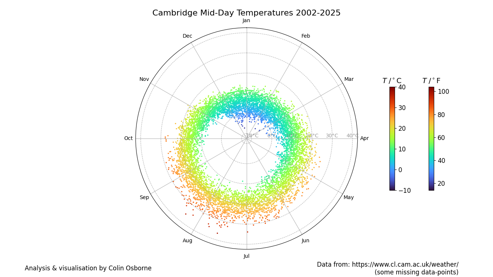
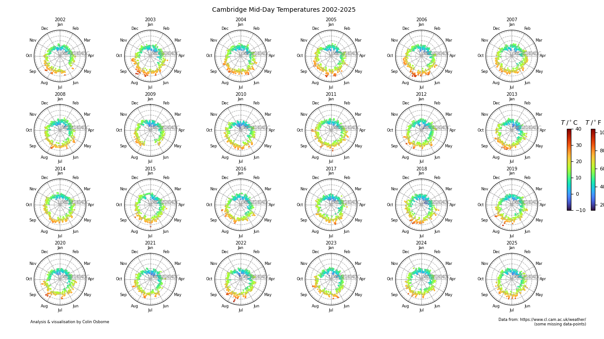

# Cambridge Weather Data Analysis

This project downloads, caches, and visualizes mid-day temperature data for Cambridge, UK, using data from the University of Cambridge Computer Laboratory weather station.

## Features
- Efficient per-year YAML caching of noon temperature data
- Only fetches missing or outdated data from the web
- Robust error handling and progress reporting
- Publication-quality polar plots with dual colorbars (Celsius and Fahrenheit)
- Colorbars are now included within the page boundaries for publication-ready output
- Reduced vertical gap between polar plots for a more compact layout
- Larger, clearer colorbars for improved readability
- Modular, well-documented code with type hints

## Requirements
Install dependencies with:

```
pip install -r requirements.txt
```

You will also need Jupyter for running the notebook. If not already installed:
```
pip install jupyter
```

## Usage
Open the `cambridge_weather.ipynb` notebook in Jupyter or VS Code and run all cells. The notebook will:
- Download and cache noon temperature data for the last 24 years (by default)
- Save data per year in the `data/` directory
- Avoid redundant web fetches using a timestamp file (`data/search_timestamps.yaml`)
- Generate polar plots of mid-day temperatures for all years

## Data Source
- [University of Cambridge Computer Laboratory Weather Data](https://www.cl.cam.ac.uk/research/dtg/weather/)


## Output
- PNG images of the polar plots are saved in the `output/` directory:

    output/CambridgeMidDayTemp_2002_2025.png  — Single-year polar plot
    output/CambridgeMidDayTemps_2002_2025.png — Multi-year polar subplots

You can view the plots directly in the notebook output, or find the saved images in the `output/` folder after running all cells.

**Layout improvements:**
- Colorbars are now fully contained within the page size (`page_width_cm` × `page_height_cm`)
- The vertical gap between polar plots has been reduced for a more compact grid
- Colorbars are larger and easier to read





## Customization
- Adjust the number of years, plot layout, or data directory by editing the parameters at the top of the notebook.

## License
This project is for research and educational use. Data copyright University of Cambridge.
